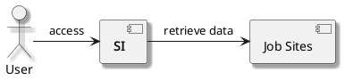

Software Requirement Specification
* Changelog
| Version Release | Major Changes                                    | Date         |
|-----------------+--------------------------------------------------+--------------|
|             1.0 | Initial release of the document                  | Aug 12, 2025 |
|             1.1 | Change zipcode to location; Report instead of UI | May 19, 2026 |

* Introduction
** Purpose
This SRS describes the functional and non-functional requirements for the StackInfo (SI) application.
** Product Scope
The SI will measure the frequency of listed stacks and technologies in a job posting for each location.
* Product Overview
** Product Perspective
The SI will allow software developers to determine what stacks are popular in an area. This will help them in deciding which stacks to pursue.

#+BEGIN_SRC plantuml :file ./A-1.png
  @startuml
  skinparam AgentBorderThickness 2
  skinparam shadowing true
  skinparam defaultTextAlignment center
  skinparam AgentStereotypeFontSize 14
  skinparam footerFontSize 15
  skinparam footerFontColor Black
  component "**SI**" as si
  component "Job Sites" as site
  actor "User" as user

  user -> si : "access"
  si -> site : "retrieve data"

  @enduml
#+END_SRC

#+RESULTS:

** Product Functions
PF-1: The product shall retrieve computer science job postings. 

PF-2: The product shall rank stacks and technologies by their frequency in job postings within a location, month, and year.

PF-3: The product shall produce a report that displays the stack and technology rankings by location, month, and year.
** Assumptions and Dependencies
DE-1: The job sites are accessible for the SI.

AS-1: Job sites accurately filter job postings by their location

AS-2: Job sites accurately filter job postings by date.
* System Features
** View Stack Rankings for each ZipCode
*** Description
The User can view each stack ranking for a location. Priority = High
** Switch from Stack to Technology
*** Description
The User can view both stacks and individual technologies. Priority = Medium
** View Stack Rankings for multiple ZipCodes
*** Description
The User can combine stack and technology rankings for multiple zipcodes. Priority = Medium
* External Interface Requirements
UI-1: The product results shall be accessible through a REST api.
* Quality Attributes
** Performance Requirements
PER-1: The system shall not take longer than 24 hours for each complete parse in order to not miss job postings.
